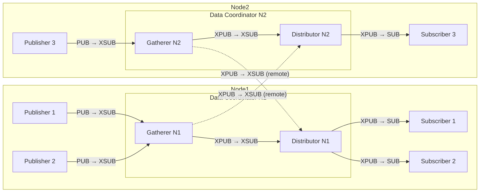

# Data protocol

The data protocol transmits messages from `publishers` to `subscribers` via a `proxy server` in a broadcasting fashion.

## Transport layer

The transport layer ensures that a message arrives at its destination.

### Socket configuration

A `proxy server` is the transmitting station, it SHALL offer an XSUBSCRIBER and an XPUBLISHER socket.
The two sockets SHALL be connected, e.g. via the `zmq.proxy_server` method.
Each of both sockets SHALL be bound to its own address.

A `Publisher` is a Component, which sends data messages via the data protocol.
It SHALL have a PUBLISHER socket connecting to the proxy server's XSUBSCRIBER socket.

A `Subscriber` is a Component, which wants to reveice data messages via the data protocol.
It SHALL have a SUBSCRIBER socket connecting to the proxy server's XPUBLISHER socket.
It SHOULD subscribe to the [Topics](data_protocol.md#topic) it wants to receive.

:::{note}
Subscribing to a topic in zmq means to subscribe to all topics which **start** with the given topic name!
:::

#### Recommended configuration

It is recommended to have a single program with two proxy servers.
The first one transfers any data and binds its XSUBSCRIBER to port number 11100 and binds its XPUBLISHER to 11099.
The second one transfers log entries and binds to 11098 and 11097, respectively.

#### Multi-node configuration

For deployments spanning multiple [Nodes](network-structure.md#node), a Data Coordinator SHOULD use a Gatherer/Distributor architecture to enable loop-free cross-node data distribution.

A Data Coordinator following this architecture contains two internally coupled proxy servers:

**Gatherer**
: A proxy server that collects messages from local publishers.
Its XSUB socket is bound to the standard port (e.g. 11100 for data) for local publishers to connect to.
Its XPUB socket is bound to a separate port (e.g. 11101 for data) for remote Distributors to connect to.

**Distributor**
: A proxy server that distributes messages to local subscribers.
Its XSUB socket connects to the local Gatherer's XPUB socket and to remote Gatherers' XPUB sockets.
Its XPUB socket is bound to the standard subscriber port (e.g. 11099 for data) for local subscribers to connect to.

Messages flow strictly from publishers through the Gatherer to the Distributor and then to subscribers.
Since there is no path from a Distributor back into any Gatherer, the topology is structurally loop-free without requiring topic-based filtering.

Each Distributor subscribes to both the local Gatherer and all remote Gatherers, ensuring that local subscribers receive messages from all Nodes in the Network.

It is recommended that a Data Coordinator participating in the control protocol exposes methods for the local [Control Coordinator](components.md#control-coordinator) to dynamically configure remote Gatherer connections during [coordinator_sign_in](control_protocol.md#coordinator-sign-in), see [Data Coordinator methods](methods.md#data-coordinator).

## Message format

A Data Protocol Message consists of 3 or more ZMQ frames ([#62](https://github.com/pymeasure/leco-protocol/issues/62)):

1. [Topic](data_protocol.md#topic)
2. [Header](data_protocol.md#header)
3. One or more data frames, the first one is the [Content](data_protocol.md#content)

### Topic

The topic is the Full name of the sending Component, encoded as printable ASCII bytes (no length prefix, no null terminator; the ZMQ frame boundary delimits the string), as defined in the [naming scheme](control_protocol.md#naming-scheme). ([#60](https://github.com/pymeasure/leco-protocol/issues/60))

Subscribers can subscribe to all messages from a specific Component by subscribing to its Full name. Due to ZMQ's prefix-matching subscription behavior, subscribing to a Namespace prefix (e.g. `N1.`) will match all messages from all Components in that Namespace.

### Header

Similar to the {ref}`control protocol header <control_protocol.md#message-composition>`, the header consists in
1. UUIDv7
2. a one byte `message_type` (`0` not defined, `1` JSON, `>127` user defined)

### Content

#### Log message content

For log messages, the content is a JSON encoded list of:
- `record.asctime`: Timestamp formatted as `'%Y-%m-%d %H:%M:%S'`
- `record.levelname`: Logger level name
- `record.name`: Logger name
- `record.text` (including traceback)
