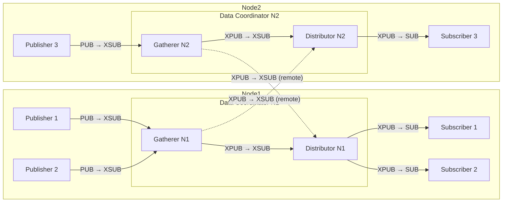

# Data protocol

The data protocol transmits messages from `publishers` to `subscribers` via a `proxy server` in a broadcasting fashion.

## Transport layer

The transport layer ensures that a message arrives at its destination.

### Socket configuration

A `proxy server` is the transmitting station, it SHALL offer an XSUBSCRIBER and an XPUBLISHER socket.
The two sockets SHALL be connected, e.g. via the `zmq.proxy_server` method.
Each of both sockets SHALL be bound to its own address.

A `Publisher` is a Component, which sends data messages via the data protocol.
It SHALL have a PUBLISHER socket connecting to the proxy server's XSUBSCRIBER socket.

A `Subscriber` is a Component, which wants to reveice data messages via the data protocol.
It SHALL have a SUBSCRIBER socket connecting to the proxy server's XPUBLISHER socket.
It SHOULD subscribe to the [Topics](data_protocol.md#topic) it wants to receive.

:::{note}
Subscribing to a topic in zmq means to subscribe to all topics which **start** with the given topic name!
:::

#### Recommended configuration

It is recommended to have a single program with two proxy servers.
The first one transfers any data and binds its XSUBSCRIBER to port number 11100 and binds its XPUBLISHER to 11099.
The second one transfers log entries and binds to 11098 and 11097, respectively.

#### Multi-node configuration

For deployments spanning multiple [Nodes](network-structure.md#node), a Data Coordinator SHOULD use a Gatherer/Distributor architecture to enable loop-free cross-node data distribution.

A Data Coordinator following this architecture contains two internally coupled proxy servers:

**Gatherer**
: A proxy server that collects messages from local publishers.
Its XSUB socket is bound to the standard port (e.g. 11100 for data) for local publishers to connect to.
Its XPUB socket is bound to a separate port (e.g. 11101 for data) for remote Distributors to connect to.

**Distributor**
: A proxy server that distributes messages to local subscribers.
Its XSUB socket connects to the local Gatherer's XPUB socket and to remote Gatherers' XPUB sockets.
Its XPUB socket is bound to the standard subscriber port (e.g. 11099 for data) for local subscribers to connect to.

Messages flow strictly from publishers through the Gatherer to the Distributor and then to subscribers.
Since there is no path from a Distributor back into any Gatherer, the topology is structurally loop-free without requiring topic-based filtering.



Each Distributor subscribes to both the local Gatherer and all remote Gatherers, ensuring that local subscribers receive messages from all Nodes in the Network.

It is recommended that a Data Coordinator participating in the control protocol exposes methods for the local [Control Coordinator](components.md#control-coordinator) to dynamically configure remote Gatherer connections during [coordinator_sign_in](control_protocol.md#coordinator-sign-in), see [Data Coordinator methods](methods.md#data-coordinator).

## Message format

A Data Protocol Message consists of 3 or more ZMQ frames ([#62](https://github.com/pymeasure/leco-protocol/issues/62)):

1. [Topic](data_protocol.md#topic)
2. [Header](data_protocol.md#header)
3. One or more data frames, the first one is the [Content](data_protocol.md#content)

### Topic

The topic is the Full name of the sending Component, encoded as printable ASCII bytes (no length prefix, no null terminator; the ZMQ frame boundary delimits the string), as defined in the [naming scheme](control_protocol.md#naming-scheme). ([#60](https://github.com/pymeasure/leco-protocol/issues/60))

Subscribers can subscribe to all messages from a specific Component by subscribing to its Full name. Due to ZMQ's prefix-matching subscription behavior, subscribing to a Namespace prefix (e.g. `N1.`) will match all messages from all Components in that Namespace.

### Header

A single ZMQ frame of exactly 17 bytes, laid out as follows:

| Offset | Length | Field             | Encoding                                       |
|--------|--------|-------------------|------------------------------------------------|
| 0      | 16     | `conversation_id` | UUIDv7, 16 bytes in network (big-endian) order |
| 16     | 1      | `message_type`    | Unsigned 8-bit integer                         |

Defined `message_type` values:

| Value | Meaning      |
|-------|--------------|
| 0     | Not defined  |
| 1     | JSON encoded |

Values 2–127 are reserved for future protocol use. Values 128–255 are available for implementation-defined use.

### Content

The first content frame carries the payload. When `message_type` is `1`, the first content frame MUST be a UTF-8 encoded JSON value. Additional content frames beyond the first are permitted for implementation-defined use but MUST be ignored by receivers that do not understand them.

#### Log message content

For log messages (`message_type` = `1`), the content is a JSON encoded list of:
- `record.asctime`: Timestamp formatted as `'%Y-%m-%d %H:%M:%S'`
- `record.levelname`: Logger level name
- `record.name`: Logger name
- `record.text` (including traceback)

### Relationship to the control protocol

Publishers and Subscribers are Components and MAY also participate in the control protocol by connecting to their Node's Control Coordinator and signing in. Doing so allows them to be addressed by Full name and enables remote management (e.g. configuring subscriptions, adjusting log levels, or shutting down).

A Publisher MUST use the same Full name as the topic that it uses when signed into the control protocol, to allow Subscribers to discover and address it.

### Wire format test vector

**Test vector: Log message from `N1.Recorder`**

Assumptions: conversation_id = `0190a2b3c4d5e6f7a8b9c0d1e2f3a4b5`, message_type = `0x01` (JSON).

```
4E312E5265636F72646572 | 0190a2b3c4d5e6f7a8b9c0d1e2f3a4b5 01 | 5B22323032352D30342D32342031323A30303A3030222C2022494E464F222C20227265636F72646572222C20224D6561737572656D656E742073746172746564225D
```

Frame breakdown:
- Frame 1: topic `N1.Recorder` (ASCII)
- Frame 2 (17 bytes): header (UUIDv7 + message_type)
- Frame 3: JSON content `["2025-04-24 12:00:00","INFO","recorder","Measurement started"]`
